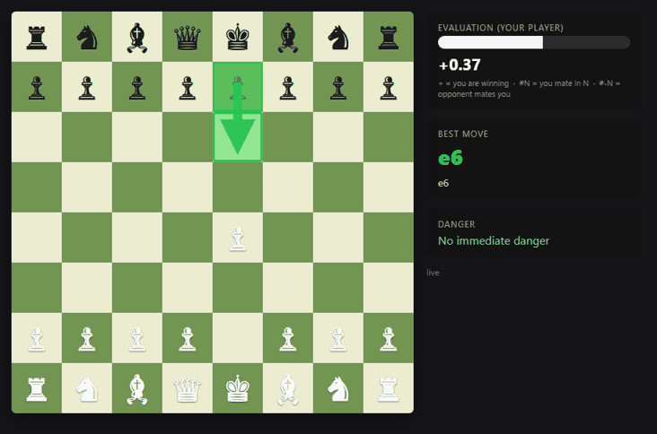
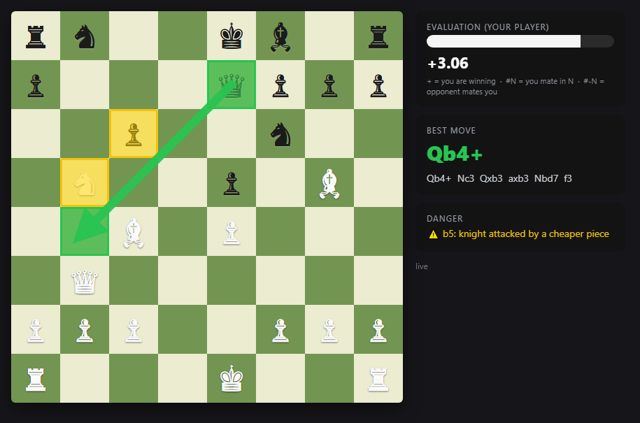
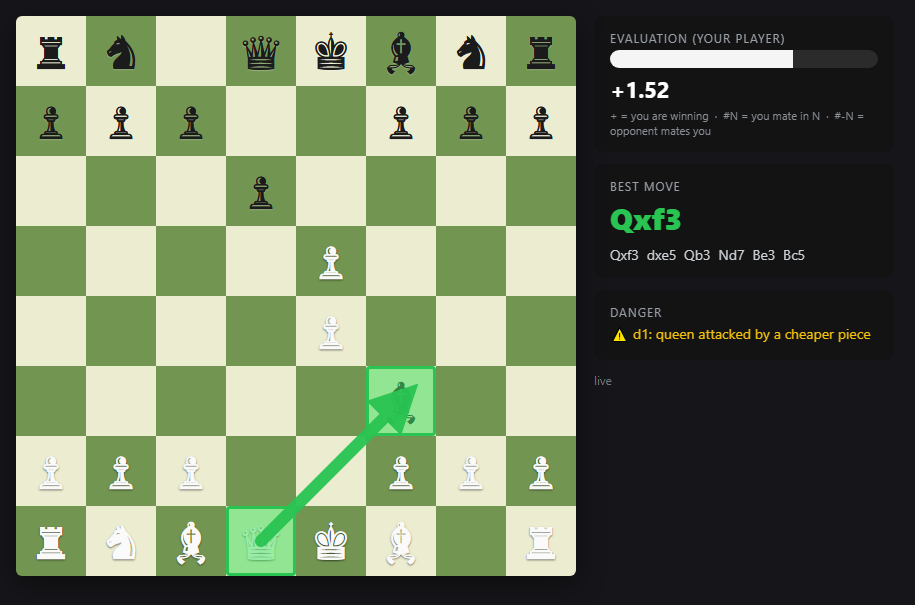
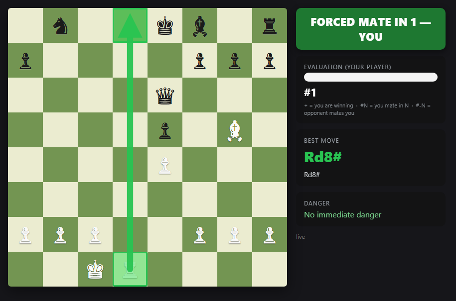
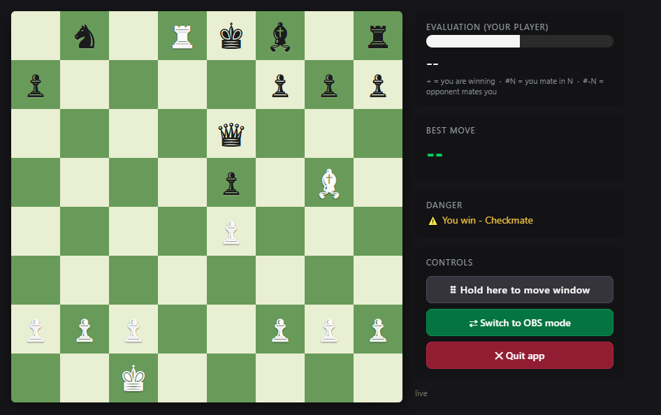

# ♟️ Chess Auditor

**A live chess analysis board for your stream.** While a game is being played on
chess.com, Chess Auditor shows your viewers, on a clean side board, what a
super-strong chess engine (Stockfish) thinks is going on:

- 🟢 **The best move**, drawn as a green arrow
- 🟡 **Pieces in danger**, highlighted in yellow (and *who* is attacking them)
- 🚨 **A big banner when there's a forced checkmate** ("MATE IN 2!")
- 📊 **An eval bar** showing who is winning and by how much
- 📝 **A report after the game** listing blunders and missed checkmates

It updates in about **a fifth of a second** after every move.

<p align="center">
  
  <br>
  <em>Chess Auditor following a full game live (Morphy's famous 1858 "Opera Game"):
  best-move arrows, danger warnings, the forced-mate countdown, and the win banner.</em>
</p>

## 💡 Where this project came from

**Chess Auditor began as a bot-detection experiment: could you tell whether your
opponent is a computer by measuring how closely their moves track a chess
engine's top recommendations?** Building that answer required live position
capture, real-time Stockfish analysis, and a clear way to visualize the
results. Iteration by iteration, those pieces evolved into what you see
today: a full broadcast analysis overlay with a post-game review tool. The
original idea lives on in the blunder report, and the same
engine-vs-played-move pipeline has plenty of room to grow: opponent accuracy
profiling, coaching and training overlays, tournament casting, educational
content, and more.

## 🚧 Project status: early version, on purpose

This is **not the finished product**. It's an early version shared publicly so
the open-source community can shape where it goes. Some paths are less tested
than others. In particular, **the OBS browser-source flow may have rough edges
in this release**, so please open an issue if something misbehaves. What this
app ultimately becomes (a coaching tool, an accuracy profiler, a casting aid,
something nobody has thought of yet) depends on your inspiration and
imagination. If you see a helpful use for it, build it, or open an issue and
tell us about it.

> ## ⚠️ Important: what this is for
> Chess Auditor is a **commentary overlay for your audience** (like the eval bar
> you see on big chess broadcasts). It is **not** allowed, and not designed,
> to feed moves to a player *during their own game*. That's cheating and breaks
> chess.com / Lichess fair-play rules. Keep the analysis on the stream, not on
> the player's screen.
>
> **And a word about cheating "to get better":** if your real goal is sharper
> thinking and quicker decisions under pressure (at work, in daily life, or
> over the board), letting an engine play your moves will not get you there.
> It will very likely do the opposite: every decision you outsource is a
> missed rep for your own calculation, pattern recognition, and nerve. Chess
> trains those skills only when *you* do the struggling. Use this app to
> **understand** games, live as a viewer or your own after the clock stops,
> not to skip the thinking.

---

## 🧰 What you need

| Thing | Why |
|---|---|
| A Windows or Linux computer | the app runs on it |
| The **Brave** or **Chrome** browser | to play/watch on chess.com |
| The **Tampermonkey** extension *(free)* | lets the app see the game; we install it together in **Step 2** |
| **OBS Studio** *(optional)* | only if you want the overlay on a stream |

Everything else (Python, the Stockfish engine, all libraries) is installed
**automatically** by the setup script below.

---

## 🚀 Step 1: Install (one time only)

### Windows

1. Click the green **Code** button at the top of this page → **Download ZIP**,
   and unzip it somewhere (for example your Desktop). *(Or `git clone` it.)*
2. Open the unzipped folder and **double-click `setup-windows.bat`**.
3. Wait. ☕ It installs Miniconda + Stockfish, sets everything up, and builds
   the app. When it prints **SETUP COMPLETE**, you're done.

You now have a `dist` folder containing **`ChessAuditor.exe`** and two
shortcuts:

| Double-click | What you get |
|---|---|
| **Chess Auditor (Desktop).lnk** | a small analysis widget on your screen |
| **Chess Auditor (OBS).lnk** | a normal window, best when using OBS |

> 💡 If Windows SmartScreen shows "Windows protected your PC", click
> **More info → Run anyway** (the exe is built on your own computer by the
> setup script, so it isn't signed).

### Linux

```bash
chmod +x setup-linux.sh && ./setup-linux.sh
```

That installs Python, Stockfish, and all libraries. On Linux there is no
desktop exe; you use the overlay in your browser instead, which looks exactly
the same:

```bash
./run-live.sh        # start the analysis server
# then open http://localhost:8765/ in your browser
```

### ✅ Quick test (both systems)

Before connecting a real game, try the built-in demo. It plays sample positions
through the whole pipeline so you can see the arrow, the warnings, and the mate
banner:

- **Windows:** `.\run-demo.ps1` &nbsp;·&nbsp; **Linux:** `./run-demo.sh`
- Open **http://localhost:8765/** and you should see the board doing its thing.
- Press `Ctrl+C` in the terminal to stop.

---

## 🔌 Step 2: Connect it to chess.com (one time only)

The app needs to *see* the game. A tiny browser script reads the board on
chess.com and sends each position to the app. Setting it up takes 2 minutes:

1. Install the **Tampermonkey** extension in your browser
   (Chrome Web Store → search "Tampermonkey").
2. Go to your browser's extensions page (`brave://extensions` or
   `chrome://extensions`), open **Tampermonkey → Details**, and turn ON
   **"Allow User Scripts"** (on older versions, turn on **Developer mode**
   instead). **Restart the browser.**
3. Click the Tampermonkey icon → **Create a new script**, delete the template
   text, and paste in the whole contents of
   [`browser/chesscom-overlay.user.js`](browser/chesscom-overlay.user.js)
   from this project. Press `Ctrl+S` to save.

**Check it works:** open any game on chess.com. A little **"chess-auditor"**
pill appears at the bottom-right of the page:

- 🟡 *starting…* → the script loaded
- 🟢 *live (game-api)* → it's sending the board to the app 🎉
- The first time, Tampermonkey asks to allow a connection to `127.0.0.1`;
  click **Always allow**.

---

## ▶️ Step 3: Use it

1. Start the app: double-click **Chess Auditor (Desktop).lnk** (Windows) or run
   `./run-live.sh` (Linux).
2. Open a game on chess.com (yours or anyone's you're casting).
3. Watch the analysis board follow the game, move by move.

What the screen shows:

| You see | It means |
|---|---|
| 🟢 Green arrow | the engine's best move right now |
| 🟡 Yellow squares | a piece is in danger + the piece attacking it |
| Green banner "MATE IN N — YOU" | your player can force checkmate in N moves |
| Red banner "MATE THREAT IN N" | the *opponent* can force checkmate. Careful! |
| Eval bar / number (e.g. `+1.5`) | positive = your player is better |

The board always shows **your player at the bottom**, whatever color they are.

| 🟢 Best move (+ a piece in danger) | 🟡 Danger close-up |
|:--:|:--:|
|  |  |

| 🚨 Forced mate found | 🖥️ The desktop app (with its Controls panel) |
|:--:|:--:|
|  |  |

In the desktop app, the **Controls** panel (under the Danger section) has:
- **⠿ Hold here to move window**: drag the widget around
- **⇄ Switch to OBS / Desktop mode**: change window style (saves and relaunches)
- **✕ Quit app**: close everything cleanly

These buttons appear only in the app window, never on your stream.

---

## 📺 Step 4: Put it on your stream (optional)

1. In OBS: **Sources → + → Browser**
2. URL: `http://localhost:8765/` &nbsp;·&nbsp; Size: 1280 × 720
3. Drag it where you want on your scene. Done.

After restarting the app, right-click the Browser source → **Refresh** if it
looks stuck.

> 🚧 Heads-up: the OBS flow is the least-tested part of this release. If
> something doesn't look right, the overlay itself almost certainly still works;
> open `http://localhost:8765/` in a normal browser to confirm, and please
> [open an issue](../../issues) so we can fix it.

---

## ⚙️ Make it faster or stronger

Open `config.yaml` (it sits next to the exe, in `dist`, and in the project
root) and change one number:

```yaml
engine:
  movetime_ms: 150     # thinking time per move, in milliseconds
```

| movetime_ms | Feel | Strength |
|---|---|---|
| **150** (default) | snappiest | still finds the right move almost always |
| 250 | great balance | strong |
| 500-1000 | slight lag | strongest in tricky tactics |

Other handy switches in `config.yaml`:
- `app.mode` (`desktop` or `obs`): which window style the exe opens with
- `app.always_on_top`: `true` keeps the desktop widget in front of every other
  window (handy while casting); default is `false` (normal window)

---

## 📋 After the game: the blunder report

Every game is saved automatically (last 10 games kept). To get a report of
missed mates, allowed mates, and blunders:

```powershell
# Windows (from the project folder)
conda activate chessauditor
python review.py            # prints the report
python review.py --html     # also writes a pretty HTML page you can screenshot
```

```bash
# Linux
.venv/bin/python review.py --html
```

---

## 🆘 Something's wrong?

| Problem | Fix |
|---|---|
| The pill on chess.com never appears | Redo Step 2.2 (Allow User Scripts) and restart the browser; check the script is **Enabled** in Tampermonkey |
| Pill says *server offline* | The app isn't running; start it (Step 3.1). Also make sure you clicked **Always allow** on the `127.0.0.1` popup |
| Window opens but stays blank | Look at `app.log` next to the exe; it usually says what failed (most often a wrong Stockfish path in `config.yaml`) |
| OBS overlay looks frozen | Right-click the Browser source → **Refresh** |
| "conda env not found" | Re-run `setup-windows.bat` |
| Wrong side at the bottom / weird eval sign | It self-corrects on the next move; report it if it persists |

---

## 🛠️ For developers

- **Run from source:** `.\run-live.ps1` (Windows) / `./run-live.sh` (Linux),
  demo via `run-demo`. The desktop window from source: `python app.py`.
- **Rebuild the exe** after code changes: `.\build-exe.ps1`.
- **Docs:** [HOWTO.md](HOWTO.md) (full setup/ops guide) ·
  [Project_Overview.md](Project_Overview.md) (architecture, data flow, design
  decisions).

```
chess-auditor/
  app.py                      desktop launcher (webview window) -> ChessAuditor.exe
  demo.py                     sample-positions demo
  review.py                   post-game blunder/mate report
  config.yaml                 engine path, thinking time, window options
  setup-windows.ps1 / .bat    one-click installer (Windows)
  setup-linux.sh              one-click installer (Linux)
  build-exe.ps1               PyInstaller build
  browser/chesscom-overlay.user.js   Tampermonkey userscript (reads the board)
  src/chess_auditor/
    main.py                   live loop: position -> engine -> overlay
    engine.py                 Stockfish wrapper (time-budgeted search)
    analysis.py               best move + danger/pin/skewer/mate detection
    overlay_server.py         tiny HTTP server (long-polling, zero frameworks)
    overlay/index.html        the rendered analysis board
    vision.py                 fallback board readers (FEN file / screen capture)
```

How it flows:

```
chess.com (browser) --userscript--> POST /fen --> analysis loop --> Stockfish
                                                        |
   overlay (browser/OBS/app) <-- long-poll /state.json <-+   (~180 ms total)
```

Pull requests welcome. 🤝
